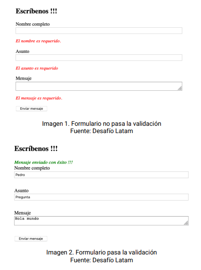
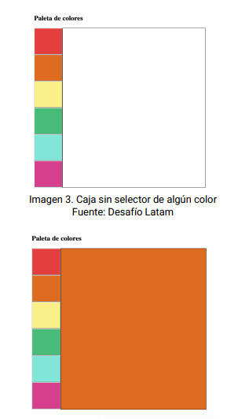

# Desafío - JavaScript en práctica

En este desafío validaremos nuestros conocimientos de Document Object Model (DOM), eventos del DOM para reaccionar a elementos HTML y Expresiones Regulares.

## Descripción

En tus tareas como desarrollador/a no sólo tendrás que escribir código desde 0, sino que muchas veces tendrás que completar tareas junto con tu equipo de trabajo, colaborando con las habilidades que cada uno posee para construir el proyecto solicitado.
En uno de los proyectos que se están trabajando en la empresa, ya se ha resuelto el código HTML por un integrante del equipo de trabajo, y te solicitan incluir la lógica de JavaScript para terminar los requerimientos. 

En el siguiente desafío pondremos en práctica el uso de listener y selectores para manipular los elementos del DOM, ya sea para cambiar sus estilos o añadir mensajes informativos para el usuario a la hora de completar un formulario que permitan validar de manera rápida y sencilla los datos ingresados por el usuario.

## Requerimientos

1. Desarrollar un código para validar un formulario de contacto utilizando el evento submit y las expresiones regulares que permitan el ingreso de caracteres desde la “A-a” hasta la “Z-z” mediante el método test() de JavaScript, mostrando un mensaje de error y/o éxito cuando corresponda. Es decir, el usuario deberá obligatoriamente ingresar datos en el formulario y que estos solo sean caracteres alfabéticos de la “a” hasta la “z” para poder enviar la información. Como se muestra en las siguientes imágenes:

2. A partir de un selector de colores, cambia el color del cuadro principal al hacer click 
sobre uno de los colores. Ver las siguientes imágenes:

3. Dar la funcionalidad de sumar y restar a la calculadora, mostrando el resultado en el 
elemento con clase resultado. Si el resultado de la resta entrega un número negativo 
debes mostrar un 0.

